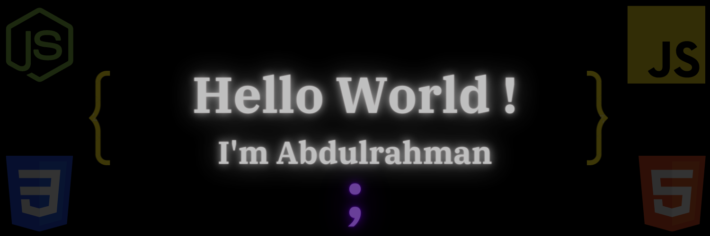

### Hi there 👋

## &#x1f4c8; GitHub Stats

 

 
 

## 💼 Skills

 

> ### Want to know how I made this README?
>
> Check out this [tutorial](https://braydoncoyer.dev/blog/creating-a-killer-github-profile-readme-part-1/) from [Braydon Coyer](https://github.com/braydoncoyer)!

<!--
**Ba72an/Ba72an** is a ✨ _special_ ✨ repository because its `README.md` (this file) appears on your GitHub profile.

Here are some ideas to get you started:

- 🔭 I’m currently working on ...
- 🌱 I’m currently learning ...
- 👯 I’m looking to collaborate on ...
- 🤔 I’m looking for help with ...
- 💬 Ask me about ...
- 📫 How to reach me: ...
- 😄 Pronouns: ...
- ⚡ Fun fact: ...
-->
